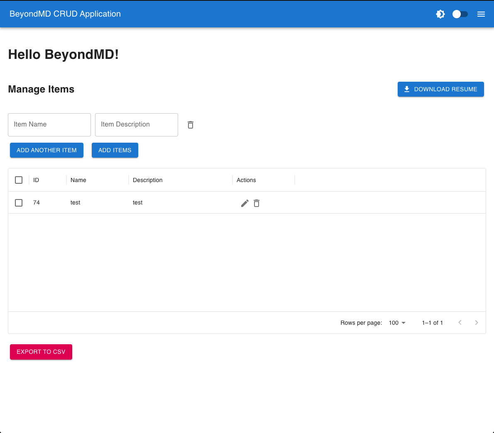
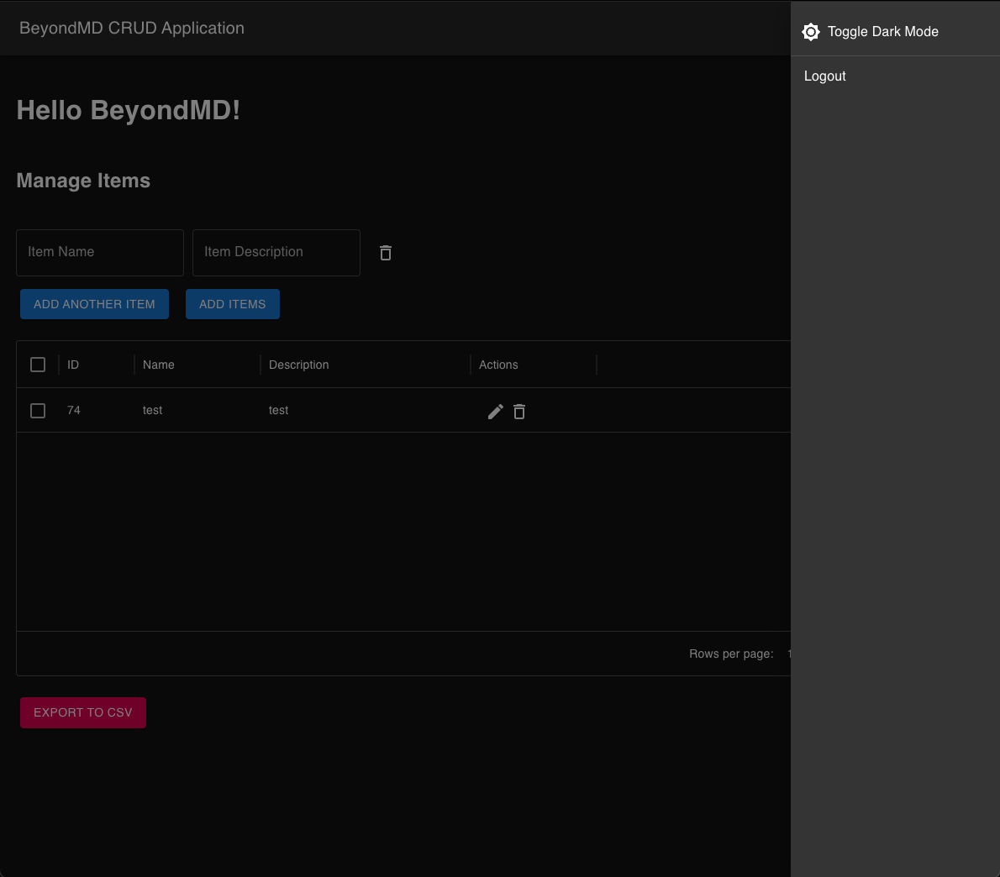

# Project Name: BeyondMD crud app

**Login Page**


**Crud Webapp**



**Dark mode**



**Django Admin Page**


This project is a full-stack web application that allows users to log in and manage data. It is built with Django for the backend and React for the frontend, containerized using Docker. The application also includes functionality to create superusers via a user-friendly interface.

## Table of Contents

- [Getting Started](#getting-started)
- [Prerequisites](#prerequisites)
- [Installation](#installation)
- [Usage](#usage)
- [Application Structure](#application-structure)
- [Running the Application](#running-the-application)
- [Creating a Superuser](#creating-a-superuser)
- [Makefile Commands](#makefile-commands)
- [Testing](#testing)
- [Troubleshooting](#troubleshooting)

## Getting Started

These instructions will help you get a copy of the project up and running on your local machine for development and testing purposes.

## Prerequisites

Make sure you have the following software installed on your system:

- [Docker](https://www.docker.com/)
- [Node.js and npm](https://nodejs.org/en/)
- [Python 3.10+](https://www.python.org/downloads/)
- [Git](https://git-scm.com/)

## Installation

1. **Clone the repository:**

   ```sh
   git clone https://github.com/yourusername/my_webapp.git
   cd my_webapp
   ```

2. **Set up the virtual environment:**

   ```sh
   python -m venv venv
   source venv/bin/activate  # On Windows use `venv\Scripts\activate`
   ```

3. **Install backend dependencies:**

   ```sh
   pip install -r requirements.txt
   ```

4. **Install frontend dependencies:**

   Navigate to the `frontend` directory and install dependencies using npm:

   ```sh
   cd frontend
   npm install
   ```

5. **Set up Docker environment:**

   Ensure Docker is installed and running, then build the Docker containers:

   ```sh
   docker-compose up --build -d
   ```

## Usage

Once the application is up and running, you can access it as follows:

- **Frontend:** Navigate to `http://localhost:3000` in your web browser.
- **Backend API:** Available at `http://localhost:8000/api/`.
- **Django Admin:** Visit `http://localhost:8000/admin/` for administrative purposes.

## Application Structure

- **backend/**: Contains Django backend code including models, views, and URLs.
- **frontend/**: Contains React frontend code for the application interface.
- **Dockerfile**: Instructions to build Docker images for both frontend and backend.
- **docker-compose.yml**: Configuration to run multiple Docker containers for the project.
- **requirements.txt**: List of Python dependencies for the backend.
- **Makefile**: Automates common tasks such as building containers, running tests, and creating users.

## Running the Application

1. **Start the containers:**

   Run the following command to start all services (frontend, backend, and database):

   ```sh
   docker-compose up --build
   ```

2. **Backend Server:**

   - The Django backend runs at `http://localhost:8000/`.

3. **Frontend Server:**

   - The React frontend runs at `http://localhost:3000/`.

## Creating a Superuser

Users can create a superuser by navigating to the login page and clicking on the "Create Superuser" button. You will be prompted to provide a username and password to create a superuser account directly from the UI.

Alternatively, you can create a superuser from the command line:

```sh
make createsuperuser
```

This will guide you through providing a username and password for the superuser.

## Makefile Commands

To streamline development and setup, a Makefile has been provided to automate tasks.

- **Build and Start Containers:**
  ```sh
  make build
  ```

- **Stop Containers:**
  ```sh
  make stop
  ```

- **Restart Containers:**
  ```sh
  make restart
  ```

- **Run Migrations:**
  ```sh
  make migrate
  ```

- **View Logs:**
  ```sh
  make logs
  ```

- **Prune Docker Objects:**
  ```sh
  make prune
  ```

## Testing

To run tests, first make sure the virtual environment is activated. You can then run Django tests using:

```sh
python manage.py test
```

For frontend testing, ensure you are in the `frontend` directory and run:

```sh
npm test
```

## Troubleshooting

1. **Docker Daemon Issues:**
   - Make sure Docker Desktop is running before executing Docker commands.

2. **Port Conflicts:**
   - Ensure ports `3000` and `8000` are not being used by other applications.

3. **Database Connection Errors:**
   - Confirm that the database container is running without issues.
   - If issues persist, run `docker-compose down -v` to remove all volumes and start fresh.

4. **Creating Superusers:**
   - Make sure to click "Create User" from the login page or use the appropriate API endpoint (`http://localhost:8000/api/create-superuser/`)
